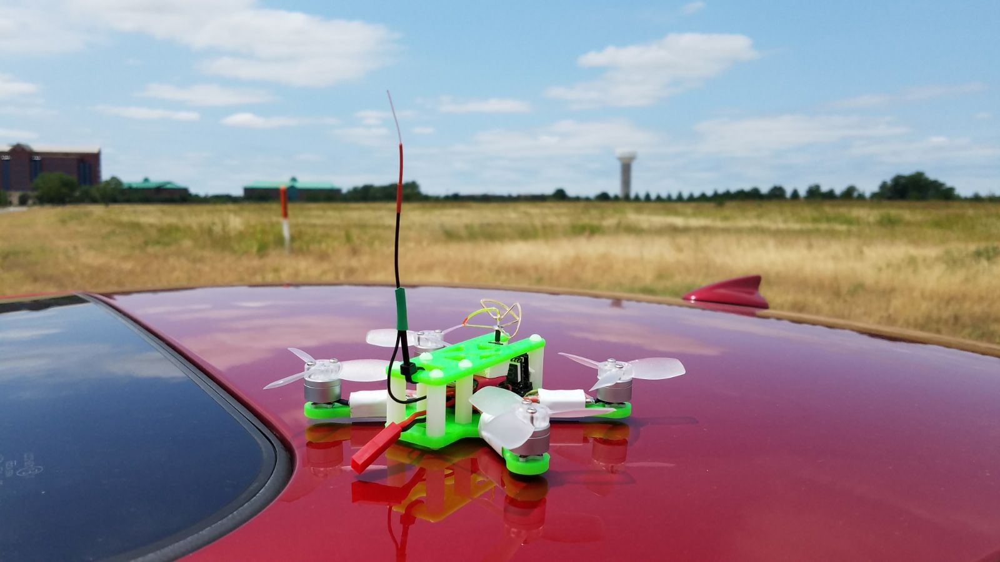
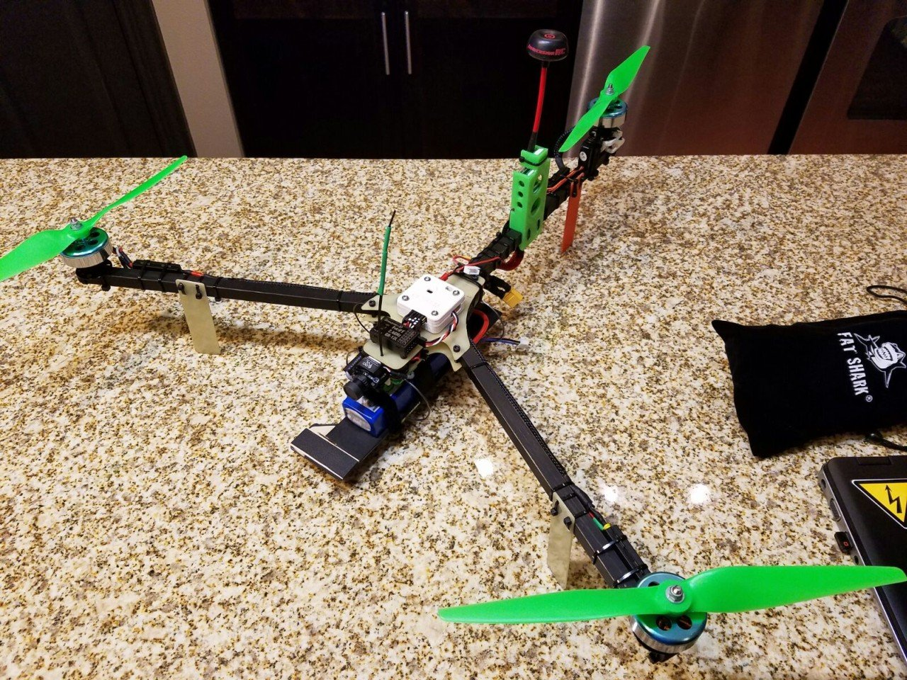
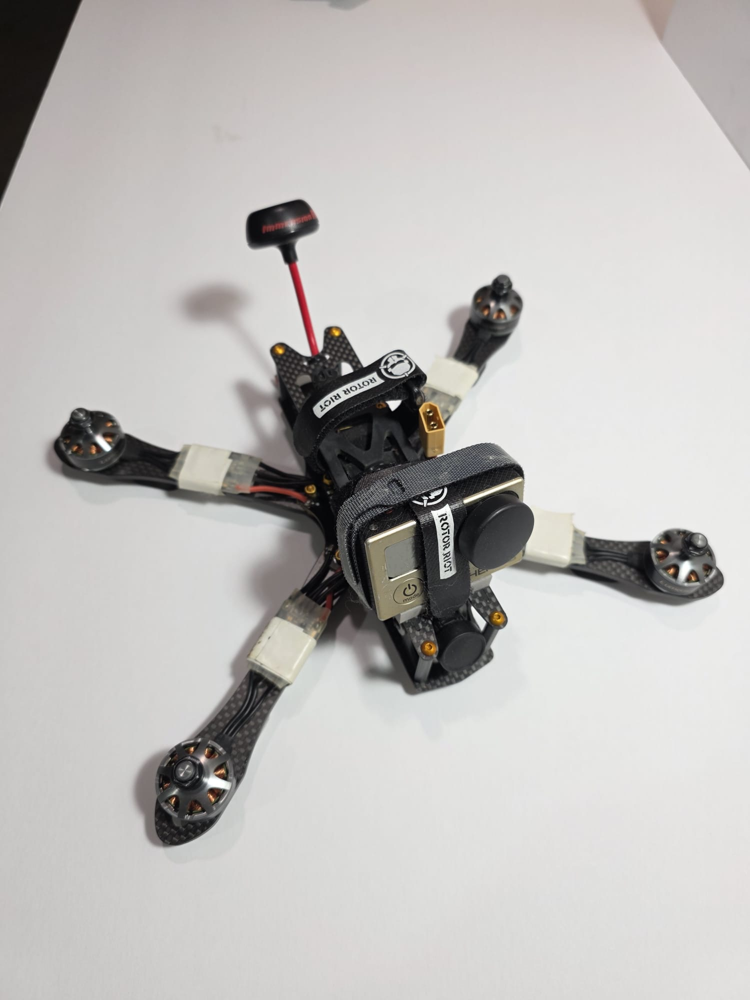
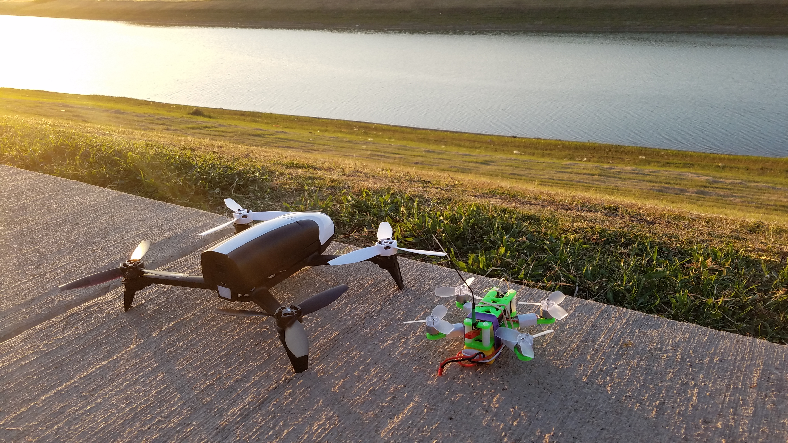
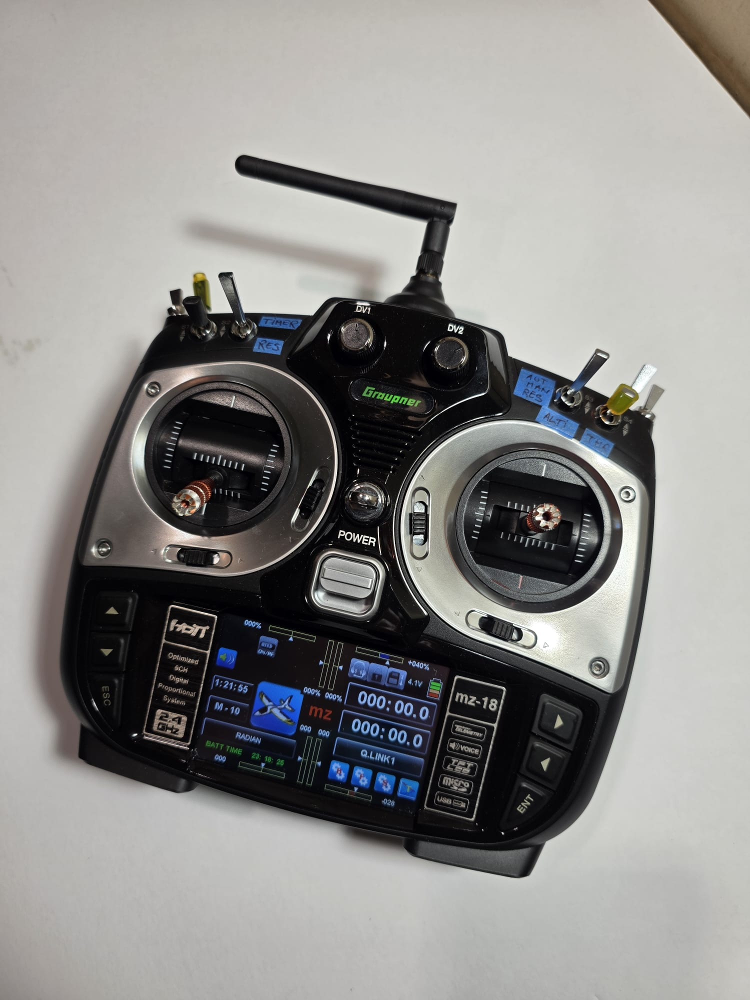

# FPV Multirotor Builds — Victor Iakab

Personal build log for the multirotors I've designed, built, tuned and flown
over about 14 years of RC aircraft (fixed wing → helicopters → FPV
multirotors). It's documented because the parts of this I enjoy most: frame 
design, wiring and integration, RF video links, bench-to-first-flight 
testing, overlap with what I do professionally.

Each build folder will have the full parts
list, more photos, and notes.

---

## 1. Scratch-designed 2" micro quad

Fully scratch-built. The frame was designed from a blank sketch in Fusion 360,
sized around 2.3" props with ~94 × 80 mm motor spacing, and 3D-printed in PLA.
Two-plate layout with the camera/VTX between the plates. All-up weight ~75 g on
a 2S 800 mAh LiPo. Emax Femto F3 flight controller, 1104 motors, four
individual BLHeli_S ESCs, 25 mW 5.8 GHz analog video, HoTT control link.

→ [Full build notes](builds/micro-quad-2in/)

## 2. Scratch-built tricopter

Large three-motor airframe built from scratch: carbon square-tube arms on a
cut plate, with the rear motor on a 3D-printed pivoting mount driven by a
servo for yaw. Naze32 flight controller, Fatshark 600 mW analog VTX, Graupner
HoTT receiver, HD action camera up front. Flies more like an aeroplane than a
quad — banked, forward-flight handling. Kept as a reference build; not first
in line for restoration.

→ [Full build notes](builds/tricopter/)

## 3. ImpulseRC Alien 6" freestyle quad

Kit frame (ImpulseRC Alien), self-assembled and wired, analog FPV with
ImmersionRC antenna, GoPro Hero for HD recording. The "big" quad of the fleet.
Parts list being reconstructed from old orders.

→ [Full build notes](builds/alien-6in/)

## 4. Where it started — Parrot Bebop 2

Off-the-shelf, but earns its place: it was the first multirotor I flew, and
I've used it mostly for range testing and autonomous waypoint missions rather
than manual flying.

---

## Ground station

One radio for everything: a Graupner MZ-18 (2.4 GHz HoTT, bidirectional
telemetry), used across fixed wing, a Blade 400 helicopter with upgraded
flybarless controller and servos, and all of the multirotors above. Still
powers up fine after several years in storage.

## What these cover

- Frame design in Fusion 360 and FDM printing (PLA), print-tuning for strength
- Component selection, soldering and wiring on 20 mm and micro form factors
- Betaflight / Cleanflight-era flight-controller setup, ESC flashing, tuning
- Analog 5.8 GHz video links (25–600 mW), antenna choice, range testing
- 2.4 GHz control links with telemetry (Graupner HoTT)
- Bench testing, first-flight procedure, crash repair
