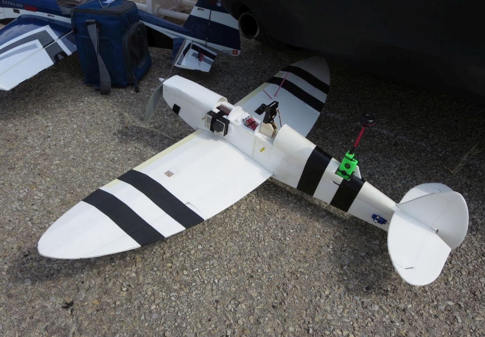
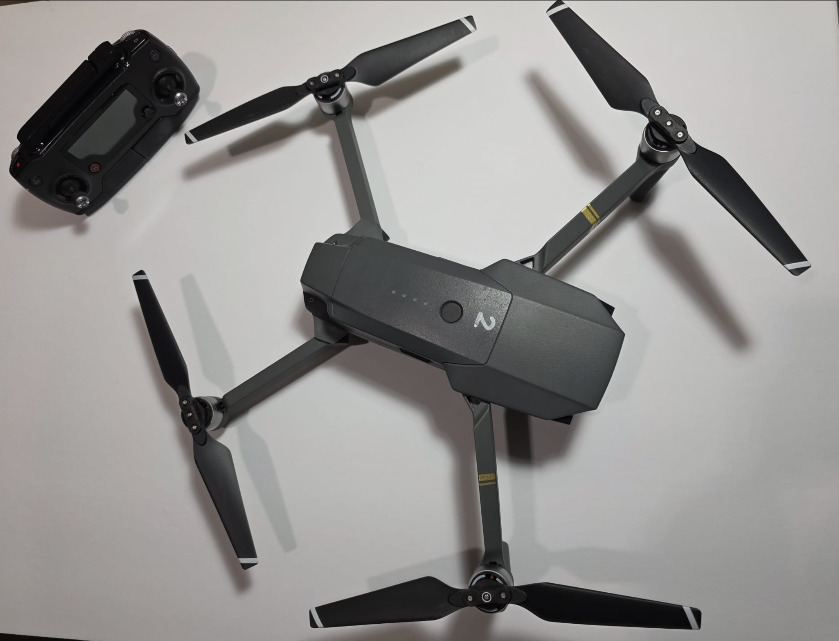

# FPV Multirotor Builds — Victor Iakab

Personal build log for the multirotors I've designed, built, tuned and flown
over about 14 years of RC aircraft (fixed wing → helicopters → FPV
multirotors). It's documented because the parts I enjoy most are frame 
design, wiring and integration and RF video links as well as bench-to-first-flight 
testing.

Each build folder will have the full parts
list, more photos, and notes.

---

## 1. Micro Quad 2"

Fully scratch-built. The frame was designed from a blank sketch in Fusion 360,
sized around 2.3" props with ~94 × 80 mm motor spacing, and 3D-printed in PLA.
Two-plate layout with the camera/VTX between the plates. All-up weight ~75 g on
a 2S 800 mAh LiPo. Emax Femto F3 flight controller, 1104 motors, four
individual BLHeli_S ESCs, 25 mW 5.8 GHz analog video, HoTT control link.

→ [Full build notes](builds/micro-quad-2in/)

## 2. Tricopter

Large three-motor airframe built from scratch: wood square-beam arms on a
delrin plate, with the rear motor on a 3D-printed pivoting mount driven by a
servo for yaw. Naze32 flight controller, Fatshark 600 mW analog VTX, Graupner
HoTT receiver, HD action camera up front. Flies more like an airplane than a
quad: banked, forward-flight handling.

→ [Full build notes](builds/tricopter/)

## 3. Foamboard Spitfire with full FPV harness

Scratch-built from foamboard sheets, then fitted out for FPV: camera on a
pan servo so I could look around in flight, Eagle Tree Vector flight
controller with OSD, GPS embedded in one wing with the receiver in the other
to keep them apart, VTX mounted as far aft as the CG allowed. Took off and
landed in full FPV.

→ [Full build notes](builds/spitfire-fpv/)

## 4. ImpulseRC Alien 6" freestyle quad

Kit frame (ImpulseRC Alien), self-assembled and wired, analog FPV with
ImmersionRC antenna, GoPro Hero for HD recording. The "big" quad of the fleet.
Parts list will be added.

→ [Full build notes](builds/alien-6in/)

## 5. Blade 400 — upgraded to flybarless

Blade 400 electric heli, upgraded from the stock flybar head to an Ikon
flybarless controller with high-end servos, on the same HoTT link as
everything else. The photo shows it before the conversion. Flown to steady
laps — the most demanding thing here to fly, and the reason the radio has a
"THR HOLD" switch.

→ [Full build notes](builds/blade-400/)

## 6. Where it started — Parrot Bebop 2

Off-the-shelf, but earns its place: it was the first multirotor I flew, and
I've used it mostly for range testing and autonomous waypoint missions.

## 7. DJI Mavic Pro (first generation)

Off-the-shelf and unmodified, and kept here on purpose: a closed, integrated
platform is a different discipline from the builds above. OcuSync digital
link, GNSS positioning, vision-based obstacle sensing and precision landing,
3-axis gimbal. I've run every flight mode it has — waypoints, ActiveTrack,
TapFly, return-to-home — mostly to understand how a production autopilot
behaves at the edges rather than to shoot video. It's the aircraft I reach
for when the goal is reliable footage instead of a project.

→ [Full build notes](builds/dji-mavic/)

---

## Transmitter

One radio for everything: a Graupner MZ-18 (2.4 GHz HoTT, bidirectional
telemetry), used across fixed wing, a Blade 400 helicopter with upgraded
flybarless controller and servos, and all of the multirotors above.

## What these cover

- Frame design in Fusion 360 and FDM printing, print-tuning for strength
- Component selection, soldering and wiring on 20 mm and micro form factors
- Betaflight / Cleanflight-era flight-controller setup, ESC flashing, tuning
- Analog 5.8 GHz video links (25–600 mW), antenna choice, range testing
- 2.4 GHz control links with telemetry (Graupner HoTT)
- Bench testing, first-flight procedure, crash repair
