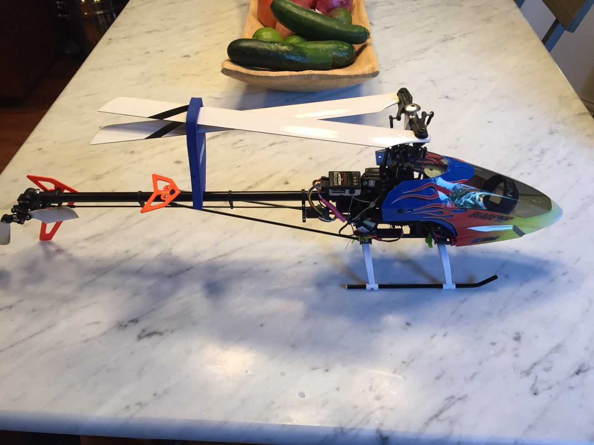
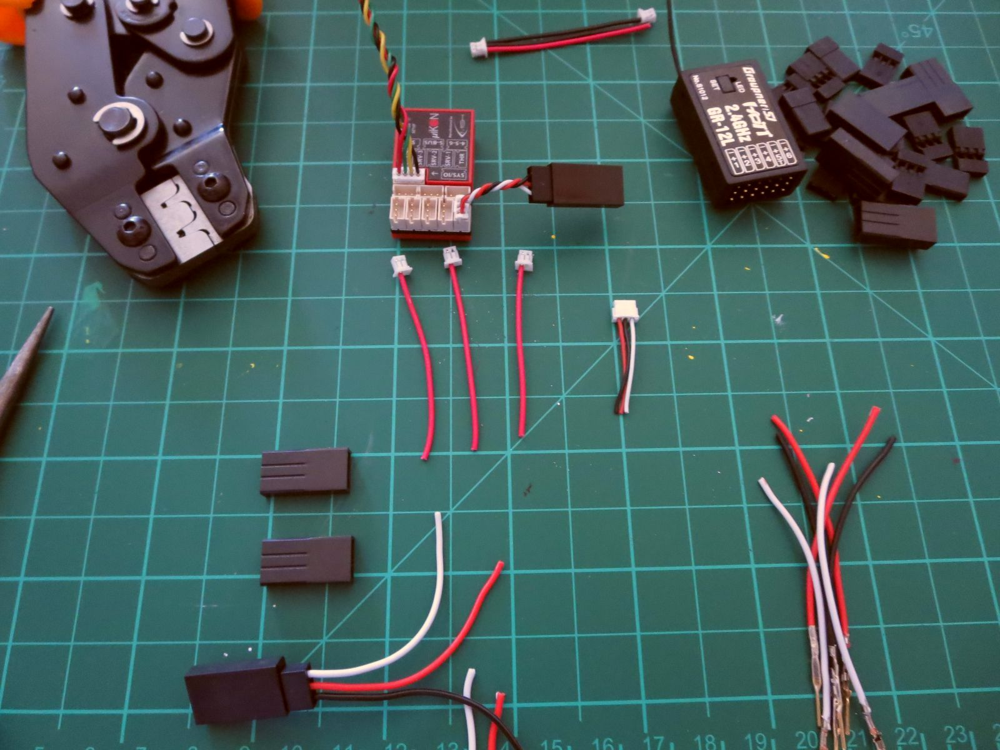

# Blade 400 — upgraded to flybarless

Blade 400 electric helicopter, converted from the stock flybar head to an
Ikon flybarless controller with high-end servos, on the same Graupner HoTT
link as everything else in the fleet. Flown to steady laps — the most
demanding aircraft here to fly.

The photo above shows it before the conversion. Below: the Ikon harness being
built up — crimped servo leads, HoTT GR-12L receiver, and the Ikon unit.

## Build

| Component | Part |
|---|---|
| Airframe | Blade 400, 3D electric heli |
| Flight controller | Ikon flybarless unit (replaced stock flybar head) |
| Servos | Upgraded from stock |
| Receiver | Graupner GR-12L (2.4 GHz HoTT) |
| Motor / ESC / battery | _not recorded_ |
