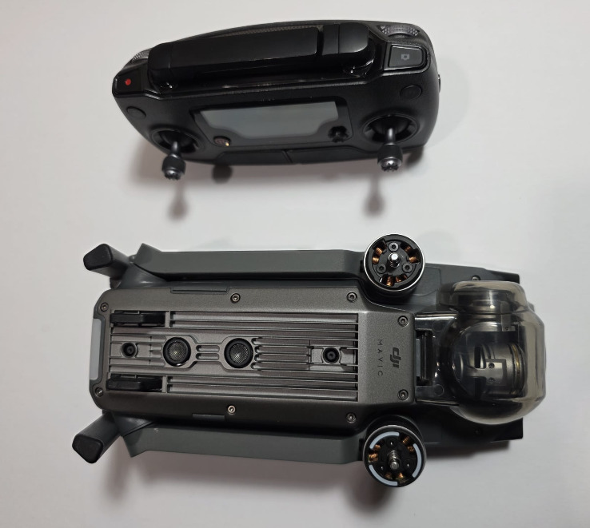

# DJI Mavic Pro (first generation)

Off-the-shelf and unmodified. Kept in this log on purpose: a closed,
integrated platform is a different discipline from the scratch builds, and
it's the aircraft I reach for when the goal is reliable footage rather than a
project.

## Platform

- OcuSync digital video/control link
- GNSS positioning with vision-based positioning and obstacle sensing
- 3-axis gimbal, 4K camera
- Folding airframe

## Flight modes tested

Every mode the aircraft offers has been flown: waypoints, ActiveTrack, TapFly,
return-to-home. Most of that time went into understanding how a production
autopilot behaves at its edges — mode transitions, what it does on link loss,
how the obstacle sensing degrades — rather than into shooting video.
