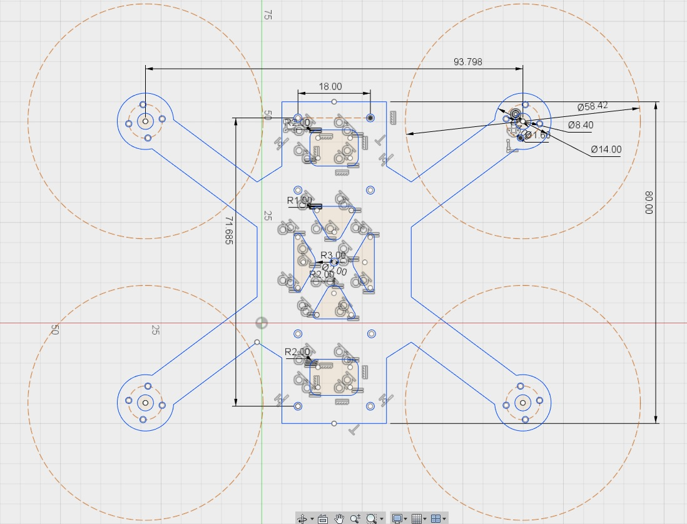
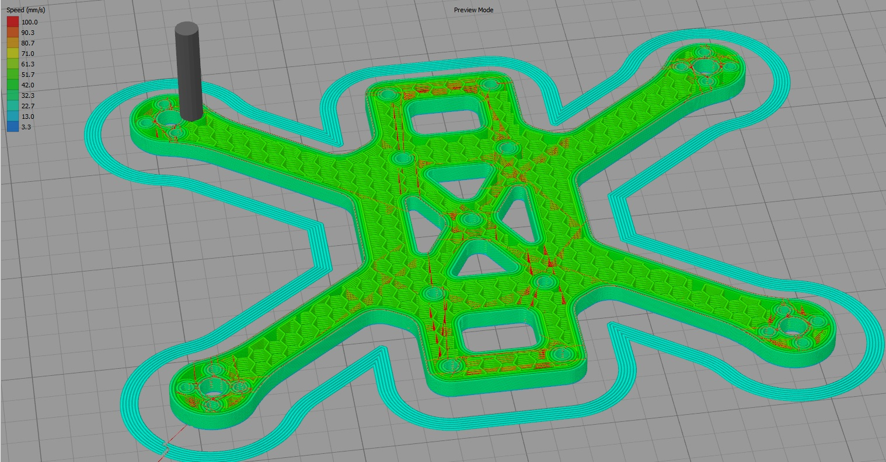
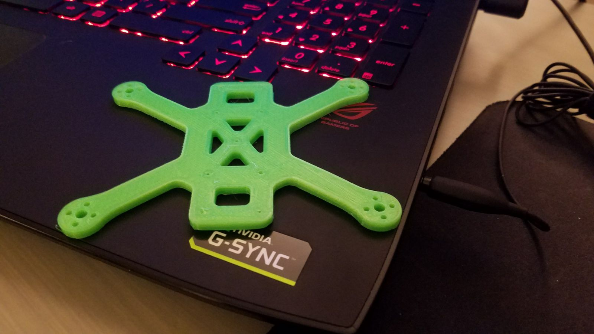
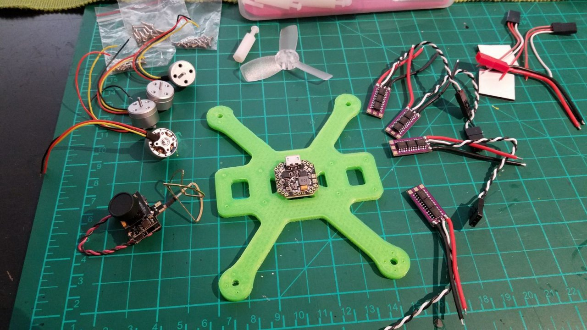
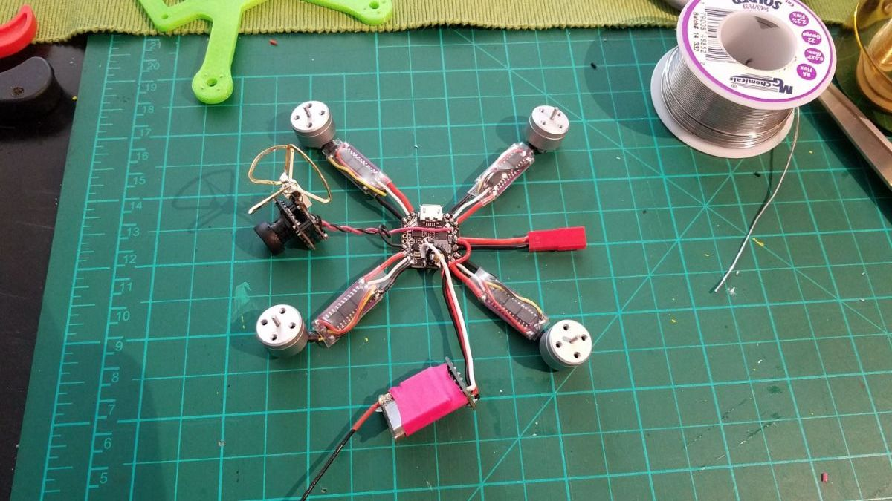

# Scratch-designed 2" micro quad

Fully scratch-built FPV micro. The frame geometry was developed iteratively in
Fusion 360 while building — no existing design as a starting point — and
printed in PLA. All-up weight ~75 g on a 2S 800 mAh LiPo.

## Design

- Motor-to-motor spacing ~94 × 80 mm (≈123 mm diagonal)
- Prop clearance circles (Ø58 mm) drawn into the sketch to size the arms
- Single-piece printed base plate with integrated arms; printed top plate on
  nylon standoffs, camera/VTX mounted between the plates
- Motor mounts sized for 1104 bolt pattern; cutouts in the base for weight and
  wire routing

| Fusion 360 sketch | Slicer preview |
|---|---|
|  |  |

## Build

| Component | Part |
|---|---|
| Frame | Custom, Fusion 360 → PLA (FDM) |
| Flight controller | Emax Femto Micro F3 |
| ESCs | 4× Emax Bullet 6A, BLHeli_S |
| Motors | 4× 1104 |
| Props | 2345 (2.3" tri-blade) |
| Camera / VTX | AKK A1 Mini AIO — camera, 25 mW 5.8 GHz VTX, cloverleaf antenna |
| Receiver | Graupner HoTT, de-cased |
| Battery | 2S 800 mAh LiPo |
| All-up weight | ~75 g |

## Status

Flown regularly until. Currently under maintenance and rebuild.

## Flight footage

_DVR footage to be added (link)._

## Notes

Redesign and print a new frame: lighter and more compact.
