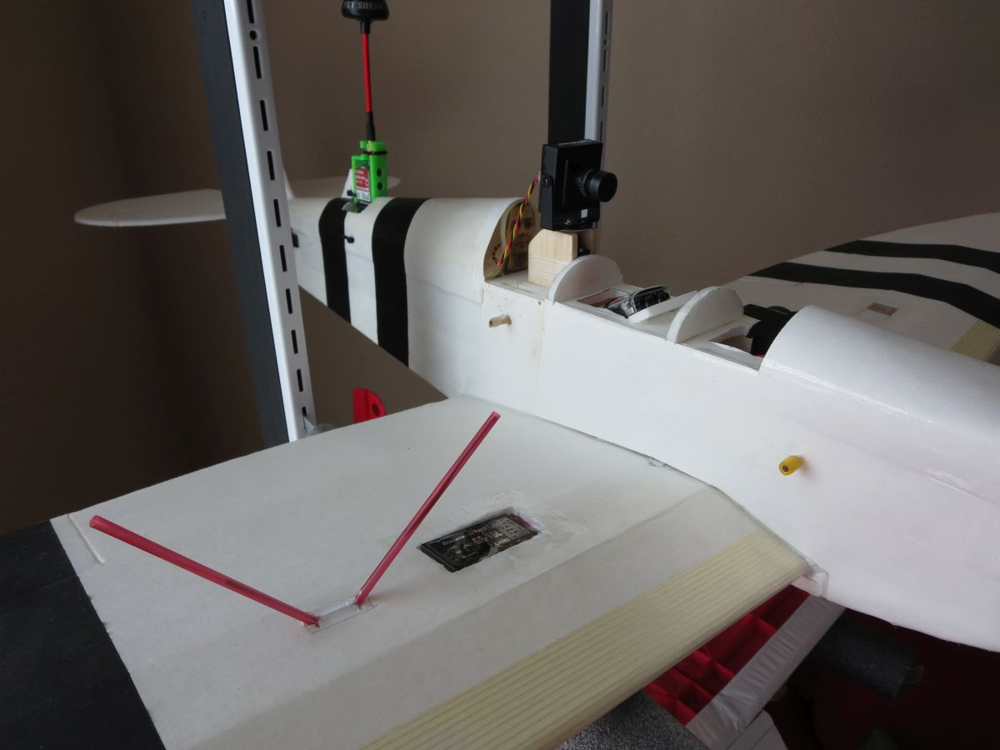

# Foamboard Spitfire with full FPV harness

Scratch-built fixed wing from foamboard sheets, then fitted out for FPV.
Flown in full FPV, including take-off and landing.

## FPV harness

- FPV camera on a pan servo, so I could look around in flight
- Eagle Tree Vector flight controller with OSD
- GPS embedded in one wing, receiver in the other, to keep them apart
- VTX mounted as far aft as the CG allowed
- GoPro up front for HD recording

## Build

| Component | Part |
|---|---|
| Airframe | Scratch-built, foamboard |
| Flight controller | Eagle Tree Vector (OSD, GPS) |
| FPV camera | Board camera on pan servo |
| VTX | Fatshark 5.8 GHz |
| Receiver | Graupner HoTT |
| Motor / ESC / prop | _not recorded_ |
| HD camera | GoPro |
