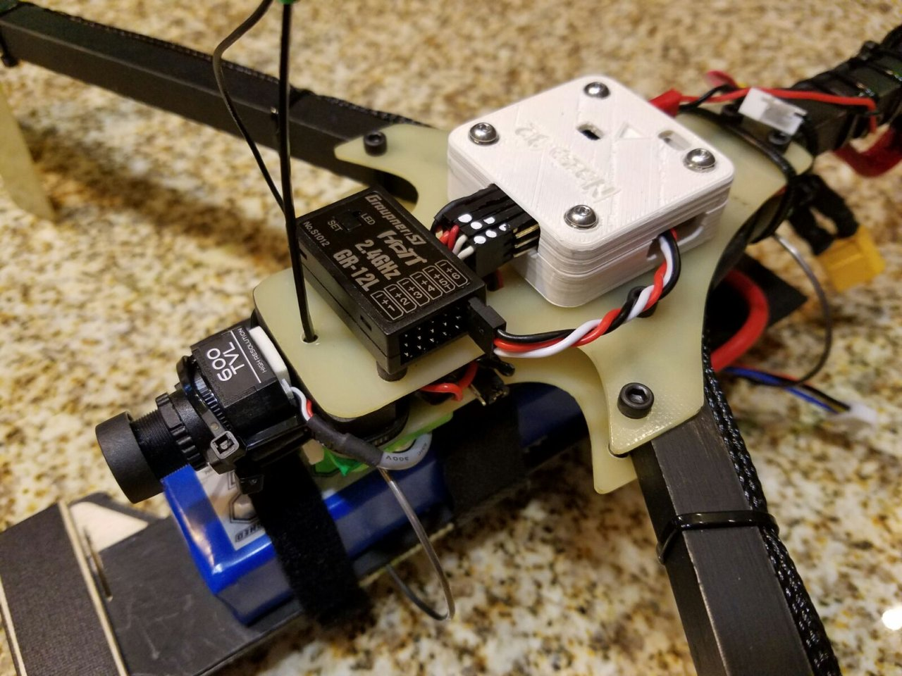
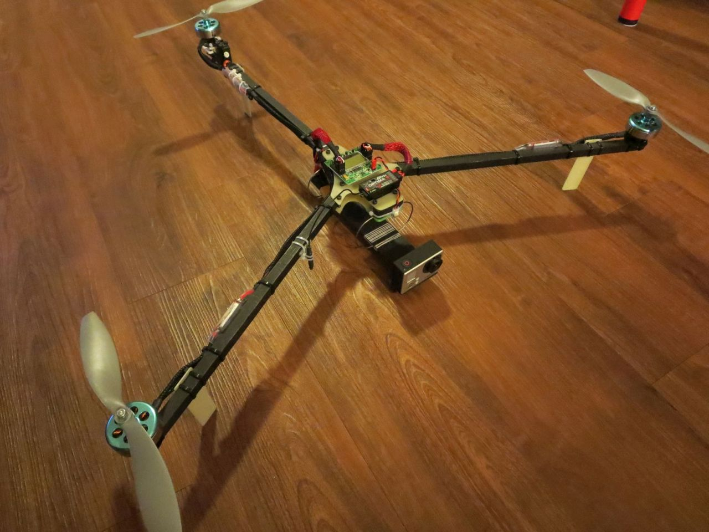

# Scratch-built tricopter

Large three-motor airframe built from scratch. Wood square-beam arms
bolted to a delrin centre plate, with the rear motor on a 3D-printed pivoting
mount driven by a servo — yaw comes from tilting the tail motor rather than
from differential torque, which is why it flies more like an airplane than a
quad: banked turns and forward-flight handling.

## Design

- Three arms, ~120° apart, wood square beam (better vibration handling vs carbon fiber); rear arm carries the servo and
  printed tilt mount
- Flat centre plate with stacked electronics; battery and camera slung
  underneath on a forward boom
- Flight controller in a 3D-printed enclosure

| Electronics stack | Airframe |
|---|---|
|  |  |

## Build

| Component | Part |
|---|---|
| Frame | Custom — carbon square-tube arms, cut plate, printed tail-tilt mount |
| Flight controller | Naze32 |
| Yaw | Servo-driven rear motor tilt |
| Motors / ESCs | _to be confirmed_ |
| Props | _to be confirmed_ |
| Camera | 600TVL analog board camera |
| VTX | Fatshark 600 mW 5.8 GHz |
| Receiver | Graupner GR-12L (2.4 GHz HoTT) |
| HD camera | Action camera on the forward boom |
| Battery | _to be confirmed_ |

## Status

Complete and previously flown. Motor, ESC and battery
details to be added.
